# ORACLE Cloud Test Drive #

## Lab 2: 创建一个自己的Bot ##

### 介绍 ###
在设计基于AI的聊天机器人对话时，需要考虑许多部分，其中包括以下内容：

 - **Intent（意图）:** 当询问Bot的问题（称为话语）时，用户的目标是什么。例如，在银行相关的机器人中，用户询问“我的余额是多少”意味着有意获得其银行账户的当前余额。
 - **Entities（实体）:** 话语中重要的信息片段，用于指定要应用预期目标的特定对象或功能。例如，“我的储蓄账户的余额是多少”意味着该问题与他们的储蓄账户有关。
 - **Steps or States（步骤或状态）:** 构成对话流程的各个问题和/或响应。在Oracle Intelligent Bot中，状态由对话流的命名“组件”实现。
 - **Dialog Flow and Decision Points（对话流和决策点）:** 基于来自用户（或Bot）的问题和/或响应，将对话向前移动到对话流程中的另一步骤。
 - **变量:** 保持对话的上下文到目前为止，允许机器人记住所讨论的内容并允许用户“离题”并返回到对话。

Oracle Intelligent Bots Platform提供了一个低代码工具，Oracle Intelligent Bots Builder，允许客户从Web浏览器开发Chatbot。这些工具使客户能够创建新的聊天机器人，定义intents（意图），entities（实体），the dialog flow（对话流），define the custom components（定义自定义组件）以及配置聊天机器人以连接到一个或多个渠道。

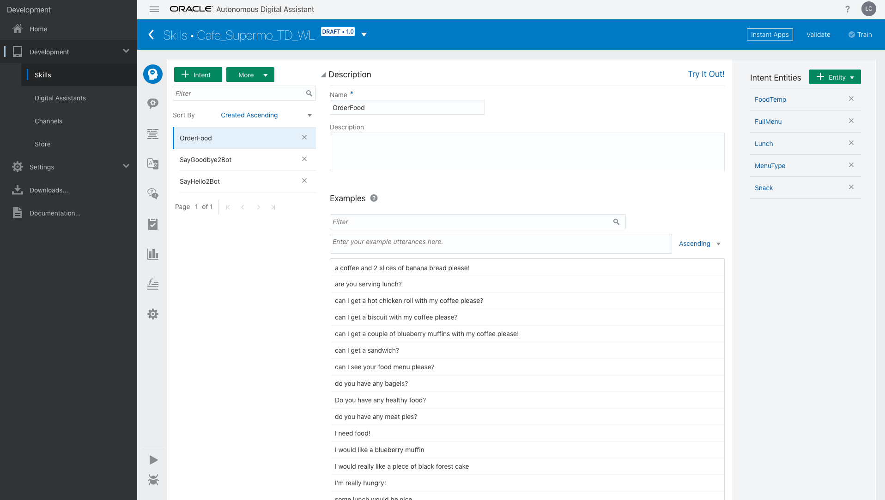

此外，Bot后台提供了实时测试自然语言处理（NLP）及其对话逻辑流程的测试（通过测试界面），允许Bot开发人员根据需要微调和重新训练聊天机器人以改进它的领域理解和最终用户体验。

在本实验中，您将利用Oracle Intelligent Bot Builder扩展CaféSupremoBot，以便从菜单中订购食物 - 无论是零食还是全套午餐订单。通过指定一些新的意图和实体，您将训练Bot所需的概念，以响应客户在咖啡馆中预定食物的需求。

### 先决条件 ###
为了简化机器人的创建，您将导入先前定义的Intent和Entities集，以及简单对话流的定义（在Oracle Bot标记语言中定义）。

将以下内容下载到方便的位置并解压缩存档以访问练习中使用的各种对象：

 - [FoodMenu Bot其中包含的Intents（意图）, Entities（实体） and Utterances（话语）](Lab_Files/Intents-And-Entities.zip)
 - [用于订购Food的OBotML对话流标记](Lab_Files/DialogYAML.zip)

### 练习步骤 ###

1. 使用以下URL访问Oracle Mobile Cloud Bot Builder

```html
http://{hostname:port}/botsui/bot
```

您的培训讲师将会告诉您对应的访问地址以及相关信息；

2. 创建一个名为``"Cafe_Supremo_TD_[YOUR INITIALS]"`` 的聊天机器人
 * 替换 ``"[YOUR INITIALS]"`` 为您的姓名首字母 - 包括 "[ ]"
 * 填写上本次Bot的版本号
 * 给您创建的Bot一个描述信息，例如： **“[YOUR NAME]创建的咖啡馆服务机器人"** (再次用你的全名或缩写替换占位符).

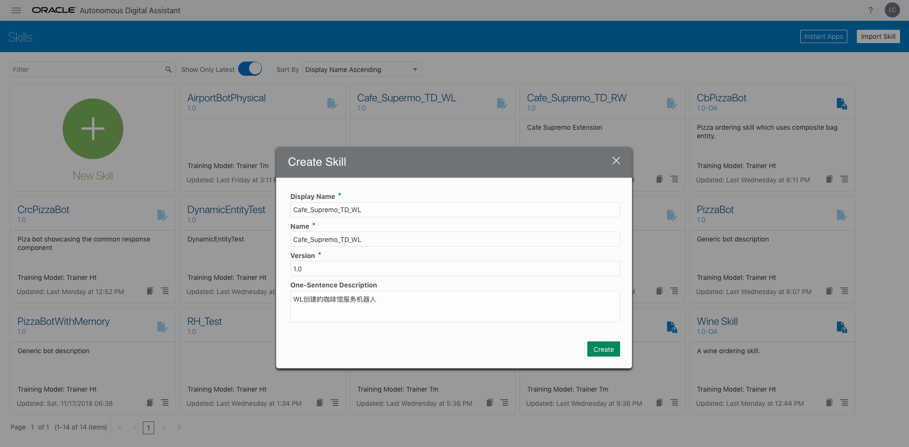

3. 点击 on the **``[import Intents]``** Button and import the **GreetingIntents.csv** from
the **“Intents and Entities”** folder.

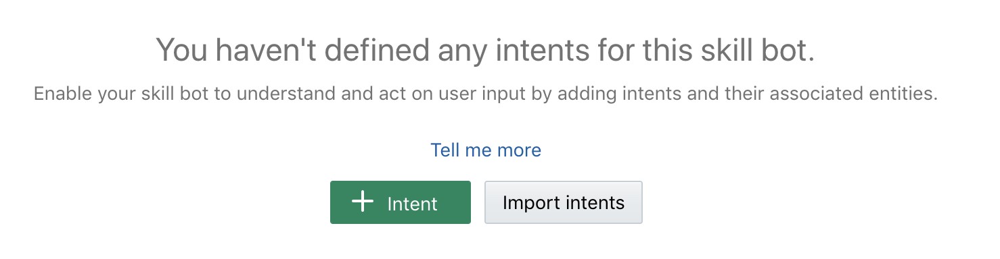

4. Click the ``[More]`` button select import intents from the drop down menu.


5. Import the **``“OrderFoodIntent.csv”``** file to load a further Intent.

6. Click on each of the Intent names in the list to see the Utterances that have been associated with that given intent


7. Click the **(!)Train** Button to choose the "training model" used to train the NLP engine on the supplied Utterances.

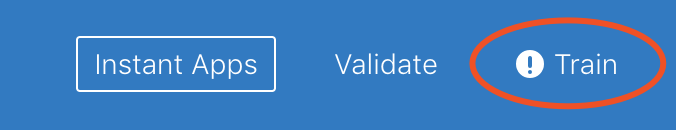

- Accept the Default model **(Trainer Ht)** by clicking on the `[Submit]` button.

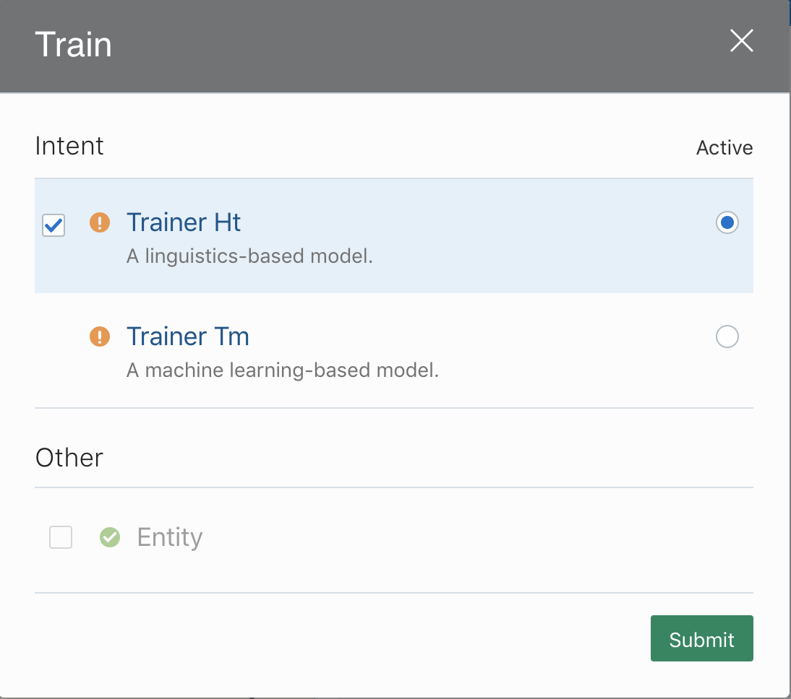

- If the NLP training was successful, you will recieve a notification similar to the following.  If successful, close the Dialog Window by click on the **[X]**.


**Note:** The dialog box will "auto-close" after a period of time if you do not close it manually.

8. Click the "Play Button" (ther right facing triangle) to launch the Bot Tester

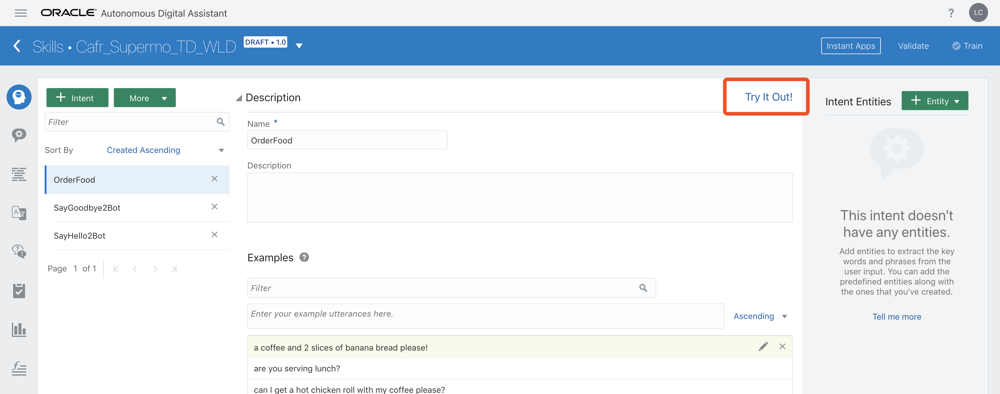

Click on the “Intent Tab”

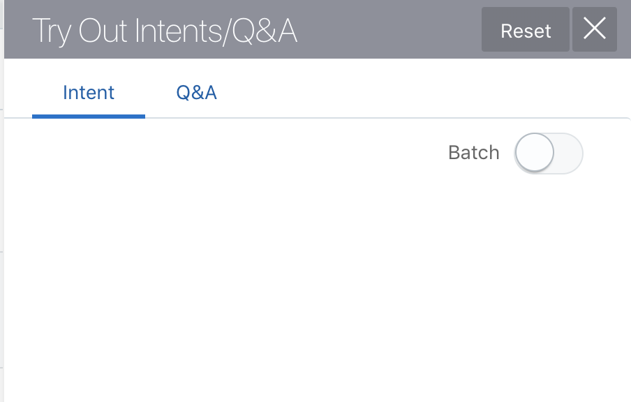

9. Try entering some input (utterance) into the message entry field at the bottom of the Chat Runtime Tester to determine what the NLP/ML had determined is your selected intent.


As suggestions; try some of the following (or make up something similar)

- I’m really Hungry
- I’d like something for Lunch
- Good morning Mr Bot!
- I’d like a bite to eat
- bye bye!

Confirm that the Intent is as expected.

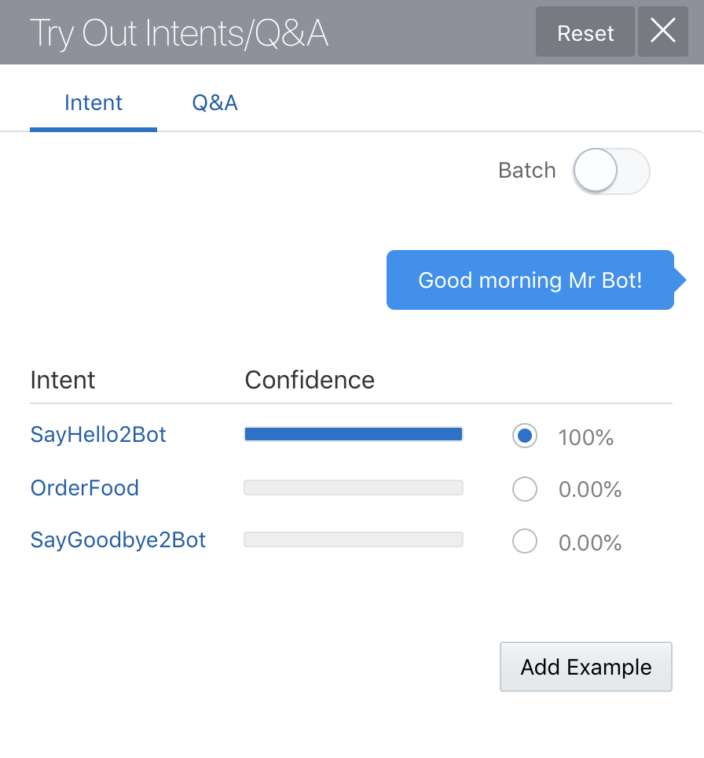 
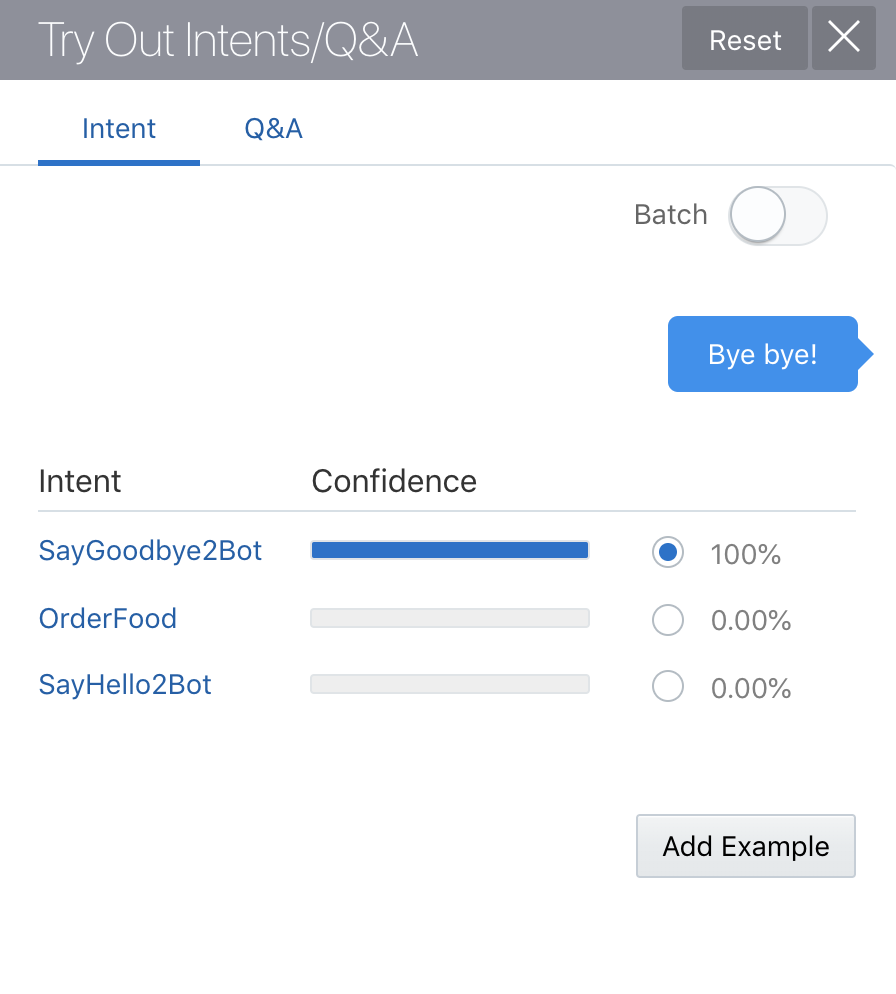 
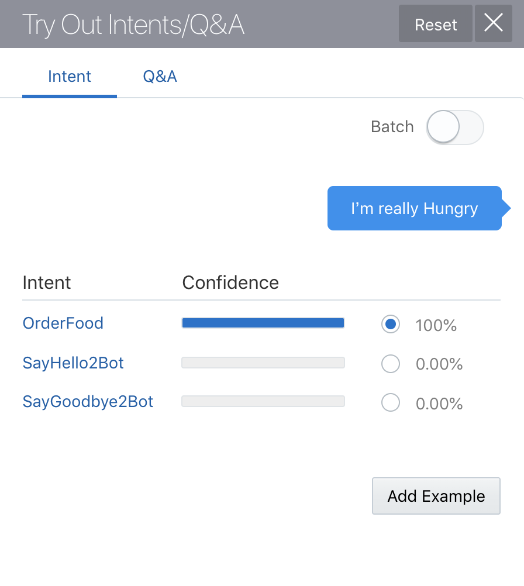

10. Enter the following utterance

- **"could really go for some real food"**

**NOTE:** Notice that the NLP (Natural Language Processing) was unable to explicitly determine the intent based on the current set of example phrases (corpus), though it still highlighted the best option. 


11. Train the NLP engine with this additional example phrase by the following: 
- Select the Radio Button that represents the best **Intent** (in this case the **"OrderFood"** intent) and click the **``[Add Example]``** Button.
- Click the '[Train] button again, which now shows a **(!)** to indicate that the sample set has changed..

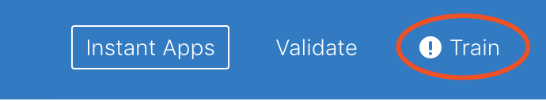

- Train the NLP again by clicking the **`[Submit]`** button.

12. Re-Enter the previous utterance into the Bot Tester and again observe the determined intent.

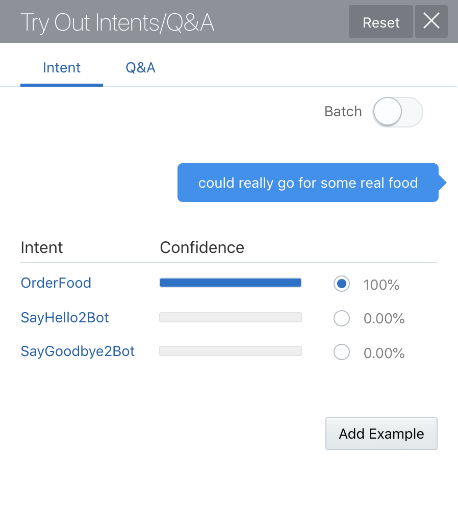

13. Click the Tester Play button again to remove it.

14. Click on the Entities Icon on the left hand side tool bar ( 2nd icon down )

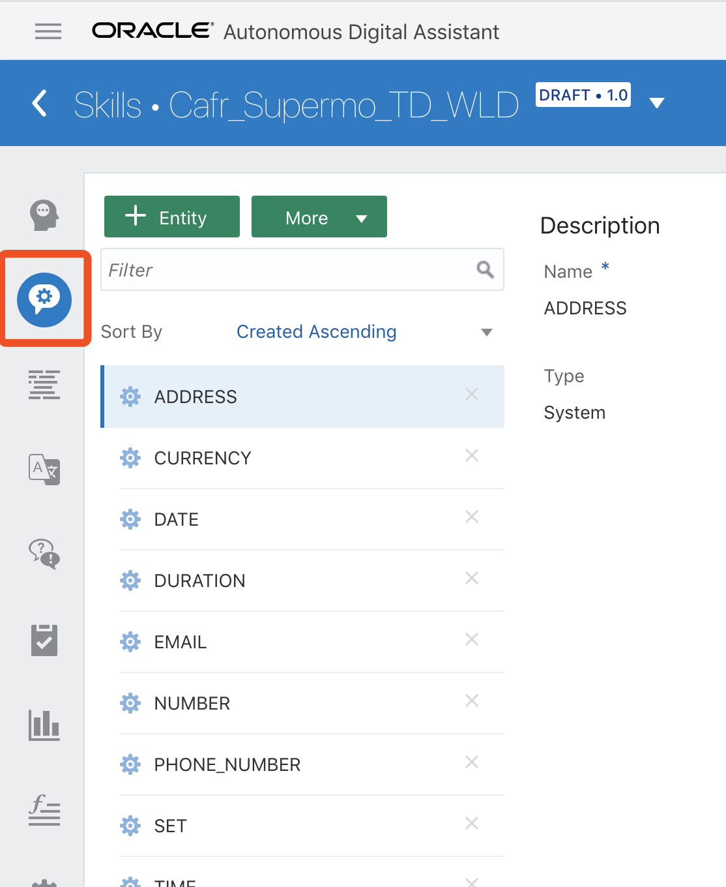

15. Click the [More] Button and select Import “Value List” Entities


16. Import the **OrderFoodEntities.csv** and **YesNoEntity.csv**

17. Manually create a new Entity by Clicking on the ``[+ Entity Button]`` – Name the new Entity **“FullMenu”**

- Select the **“Entity List”** option from the Configuration Drop down menu and then click into the Entities field below the dropdown list.


- Choose the “**Lunch**” and “**Snack**” lists to create a “super list” entity made
up of both sub lists.
- Delete any other Entities from the list (eg. FoodTemp)

18. Go back to the Intent Tab (the top Icon) and select The “OrderFood” Intent and click on the ``[+Entity]`` Button in the Top Right Corner.


19. Scroll down the list and select the listed Entity Definitions (with Orange Box) to add them to the current intent
  - FoodTemp 
  - Lunch
  - Snack
  - FullMenu
  - MenuType  

Associating the Entity with the Intent gives a meaningful domain to the possible values and hence makes it easier for the  NLP to evaluate the appropriate information.


20. Restart the Tester (click the RESET button if it still shows your previous
entry).

21. Enter an Utterance to see how it has evaluated the Entities with the
defined intent.

eg. **"I'd like a nice hot beef pie for lunch"**

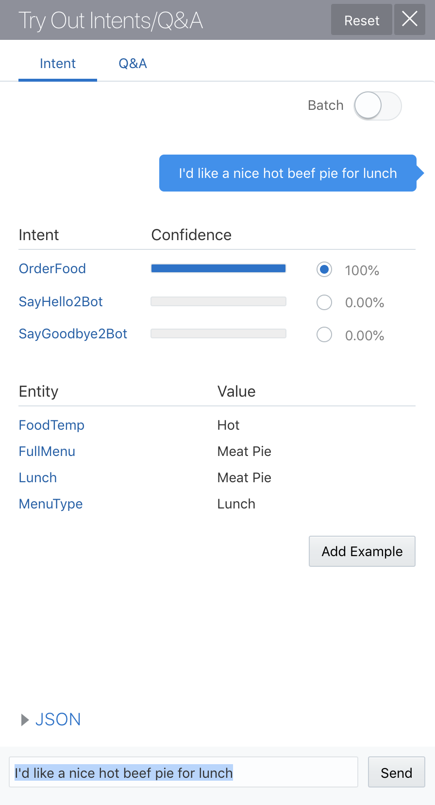

- Close the tester for the time being.

22. Open the file **OrderFoodDialog.txt** file in the DialogYAML directory in a
text editor and select all the Text (eg. cntrl-A) and copy into the "paste buffer".

23. Select the Dialog Tab in the left hand toolbar (3rd Icon)


24. Delete the Default Starter BotML (YAML) code and paste in the contents
of the ``**OrderFoodDialog.txt**`` file opened previously.

25. Click the Validate Button to Confirm that the 'cut and paste' was successful.


26. Restart the Tester and change to the “Bot” tab

27. Enter a number of Utterances to observe the flow of the Bot.

- I’m really Hungry
- I’d like something for Lunch
- Can I have a chicken wrap
- I’d like a bite to eat
- Could really go for some real food
- Can I have a slice of Banana Bread with my coffee please?

(Try some others of your own)

# End of Lab 2: #

In [Lab 3](300-IB.md), you will learn to configure the Bot access data from your organisations "Systems of Record"

<< [Back to Digital Assistant Test Drive Home](../README-ODA.md)
