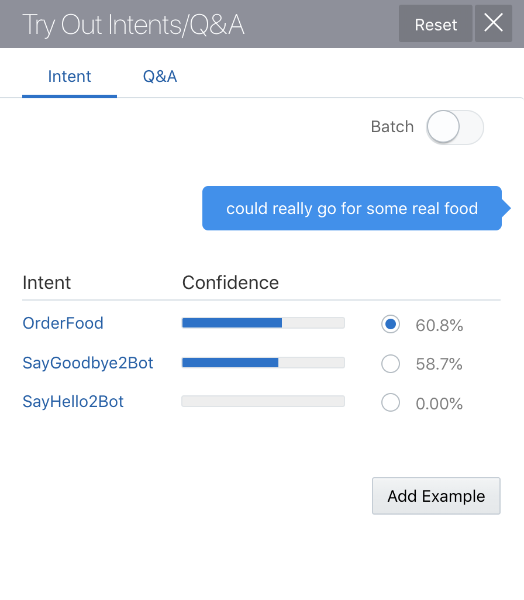
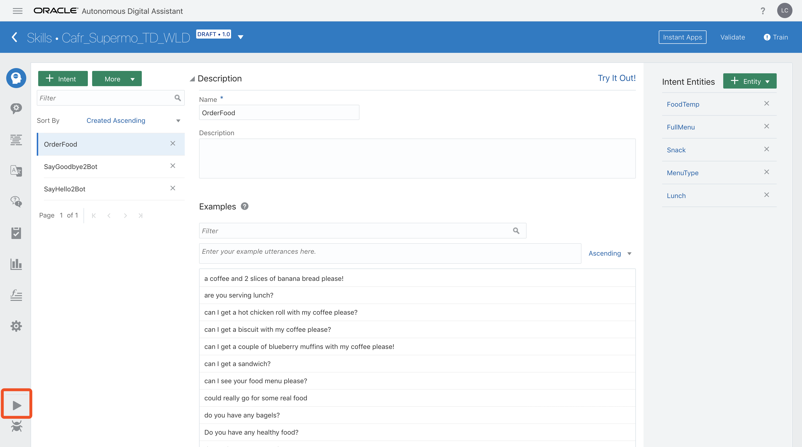

# ORACLE Cloud Test Drive #

## Lab 2: 创建一个自己的Bot ##

### 介绍 ###
在设计基于AI的聊天机器人对话时，需要考虑许多部分，其中包括以下内容：

 - **Intent（意图）:** 当询问Bot的问题（称为话语）时，用户的目标是什么。例如，在银行相关的机器人中，用户询问“我的余额是多少”意味着有意获得其银行账户的当前余额。
 - **Entities（实体）:** 话语中重要的信息片段，用于指定要应用预期目标的特定对象或功能。例如，“我的储蓄账户的余额是多少”意味着该问题与他们的储蓄账户有关。
 - **Steps or States（步骤或状态）:** 构成对话流程的各个问题和/或响应。在Oracle Intelligent Bot中，状态由对话流的命名“组件”实现。
 - **Dialog Flow and Decision Points（对话流和决策点）:** 基于来自用户（或Bot）的问题和/或响应，将对话向前移动到对话流程中的另一步骤。
 - **变量:** 保持对话的上下文到目前为止，允许机器人记住所讨论的内容并允许用户“离题”并返回到对话。

Oracle Intelligent Bots Platform提供了一个低代码工具，Oracle Intelligent Bots Builder，允许客户从Web浏览器开发Chatbot。这些工具使客户能够创建新的聊天机器人，定义intents（意图），entities（实体），the dialog flow（对话流），define the custom components（定义自定义组件）以及配置聊天机器人以连接到一个或多个渠道。


此外，Bot后台提供了实时测试自然语言处理（NLP）及其对话逻辑流程的测试（通过测试界面），允许Bot开发人员根据需要微调和重新训练聊天机器人以改进它的领域理解和最终用户体验。

在本实验中，您将利用Oracle Intelligent Bot Builder扩展CaféSupremoBot，以便从菜单中订购食物 - 无论是零食还是全套午餐订单。通过指定一些新的意图和实体，您将训练Bot所需的概念，以响应客户在咖啡馆中预定食物的需求。

### 先决条件 ###
为了简化机器人的创建，您将导入先前定义的Intent和Entities集，以及简单对话流的定义（在Oracle Bot标记语言中定义）。

将以下内容下载到方便的位置并解压缩存档以访问练习中使用的各种对象：

 - [FoodMenu Bot其中包含的Intents（意图）, Entities（实体） and Utterances（话语）](Lab_Files/Intents-And-Entities.zip)
 - [用于订购Food的OBotML对话流标记](Lab_Files/DialogYAML.zip)

### 练习步骤 ###

1. 使用以下URL访问Oracle Digital Assistant Builder

```html
http://{hostname:port}/botsui/bot
```

您的培训讲师将会告诉您对应的访问地址以及相关信息；

2. 创建一个名为``"Cafe_Supremo_TD_[YOUR INITIALS]"`` 的聊天机器人
 * 替换 ``"[YOUR INITIALS]"`` 为您的姓名首字母 - 包括 "[ ]"
 * 填写上本次Bot的版本号
 * 给您创建的Bot一个描述信息，例如： **“[YOUR NAME]创建的咖啡馆服务机器人"** (再次用你的全名或缩写替换占位符).


3. 单击 **``[import Intents]``** 按钮，并从**“Intents and Entities”**文件夹中导入 **GreetingIntents.csv** 文件


4. 单击 ``[More]`` 按钮从下拉菜单中选择导入意图。


5. 导入 **``“OrderFoodIntent.csv”``** 文件以加载进一步的Intent。

6. 单击列表中的每个Intent名称以查看与该给定intent相关联的话语


7. 单击 **(!)Train** 按钮以选择用于在所提供的话语上训练NLP引擎的“训练模型”。


- 单击按钮接受默认模型 **(Trainer Ht)** ，并点击 `[Submit]` 按钮.


- 如果NLP培训成功，您将收到类似以下的通知。如果成功，请单击 **[X]** 关闭对话窗口


**注意:** 如果不手动关闭对话框，则会在一段时间后“自动关闭”。

8. 单击“Try It Out！”（意图页面中）以启动Bot 意图测试页面


点击“Intent”意图选项卡


9. 尝试在测试页面底部的消息输入字段中输入一些测试语句，以确定NLP / ML识别的是您选择的意图。


作为建议; 尝试下面的一些语句：

- I’m really Hungry
- I’d like something for Lunch
- Good morning Mr Bot!
- I’d like a bite to eat
- bye bye!

确认Intent符合预期。

 
 


10. 输入以下话语

- **"could really go for some real food"**

**注意:** 请注意，NLP（自然语言处理）无法基于当前的示例短语集（语料库）明确确定意图，但仍然突出显示最佳选项。



11. 使用以下附加示例短语训练NLP引擎：
- 请选择代表识别率最高的**Intent** (在这次识别中是 **"OrderFood"** 这个意图Intent) ，然后点击 **``[Add Example]``** 按钮.
- 点击完成后，在点击 '[Train] 训练按钮, 当意图发生了改变时就会出现 **(!)** ，以表示训练语句有所更改，需要再次训练。


- 单击 **`[Submit]`** 按钮，再次完成训练NLP的动作。

12. 这个时候，将之前的那句语句再次输入Intent测试页面当中，查看效果


13. 单击 **【X】** 按钮将页面关闭。

14. 单击左侧工具栏上的实体图标（向下第二个图标）


15. 单击 [More] 按钮，然后选择导入“Value List”实体


16. 导入 **OrderFoodEntities.csv** 和 **YesNoEntity.csv** 这两个实体文件

17. 通过单击 ``[+ Entity Button]`` 按钮，命名新实体 **“FullMenu”** 完成手动创建

- 从配置下拉菜单中选择 **“Entity List”** 选项，然后单击下拉列表下方的实体字段。


- 选择 “**Lunch**” 和 “**Snack**” 列表以创建由两个子列表组成的 “super list” 实体。
- 从列表中删除任何其他实体（例如FoodTemp）

18. 返回Intent选项卡（顶部图标）并选择“OrderFood” Intent（意图），然后单击右上角的 ``[+Entity]`` 按钮。


19. 向下滚动列表并选择列出的实体定义（使用橙色框）将它们添加到当前意图
  - FoodTemp 
  - Lunch
  - Snack
  - FullMenu
  - MenuType  

将Entity（实体）与Intent（意图）进行关联，为该意图可能需要获取的值提供了实体域，提供自然语言识别NLP所需的实体参数，让语义能够被理解。


20. 重启启动Bot自带Intent测试程序 Try It Out（如果它已有测试数据，请单击“reset”按钮）。

21. 输入测试语句以查看它如何使用定义的Intent（意图）评估将Entity（实体）。

例如： **"I'd like a nice hot beef pie for lunch"**


- 测试完成后，可以先关闭测试窗口。

22. 请打开文件 **OrderFoodDialog.txt** ，在文本编辑器中选择所有文本（例如，CTRL-A），然后选择复制。

23. 选择左侧工具栏中的“对话框”选项卡（第3个图标）


24. 删除默认启动器BotML（YAML）代码并粘贴 ``**OrderFoodDialog.txt**`` 先前打开并复制的文件内容。

25. 单击“验证”按钮以确认“剪切和粘贴”成功。


26. 点击页面左下角 ** ▶️ ** 播放按钮，启动测试程序窗口，进行测试。



27. 此时，可以输入一些测试语句，来进行Bot的测试：

- I’m really Hungry
- I’d like something for Lunch
- Can I have a chicken wrap
- I’d like a bite to eat
- Could really go for some real food
- Can I have a slice of Banana Bread with my coffee please?

(也可以自己尝试一些自己想要提问的语句)

# 实验2结束: #

在 [实验 3](300-IB.md), 您将学习如何从您的企业业务系统中获取数据，并进行Bot访问数据的配置。

<< [返回 Digital Assistant Test Drive 主页](../README-ODA.md)
