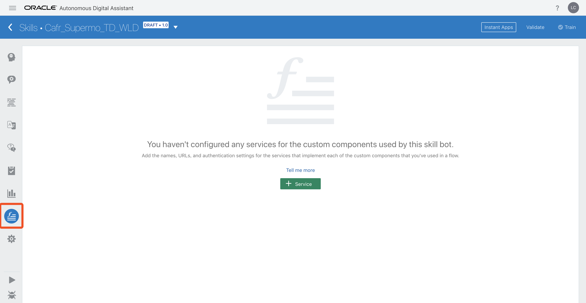
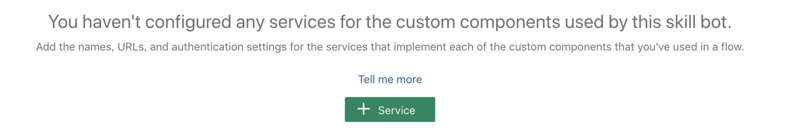
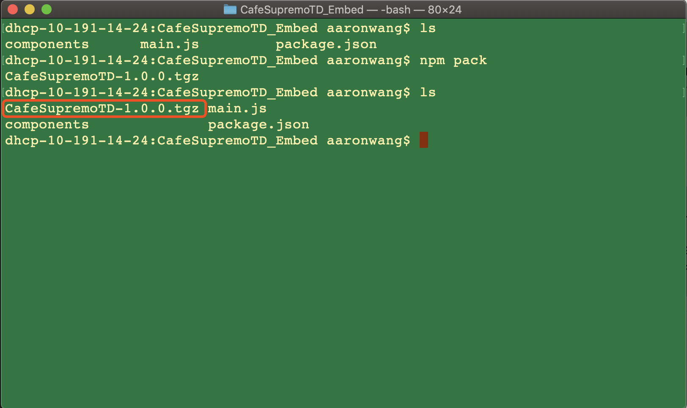
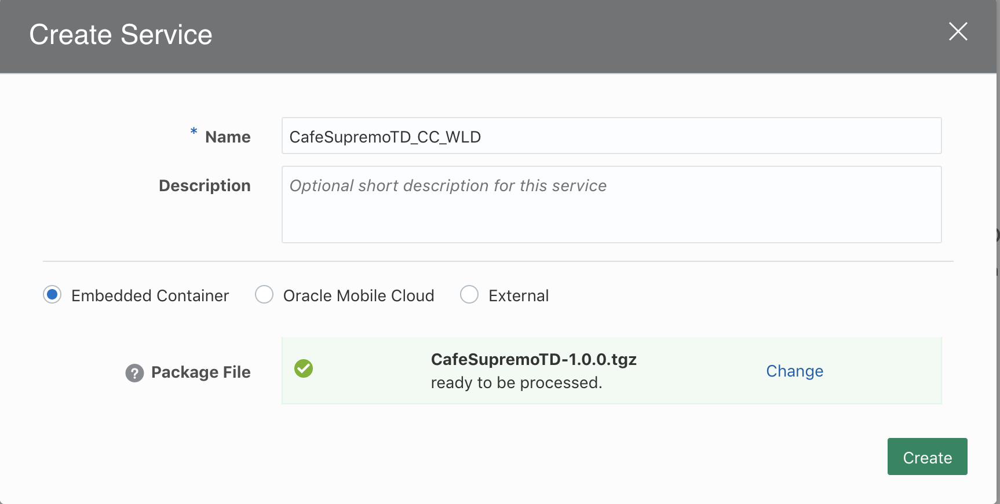
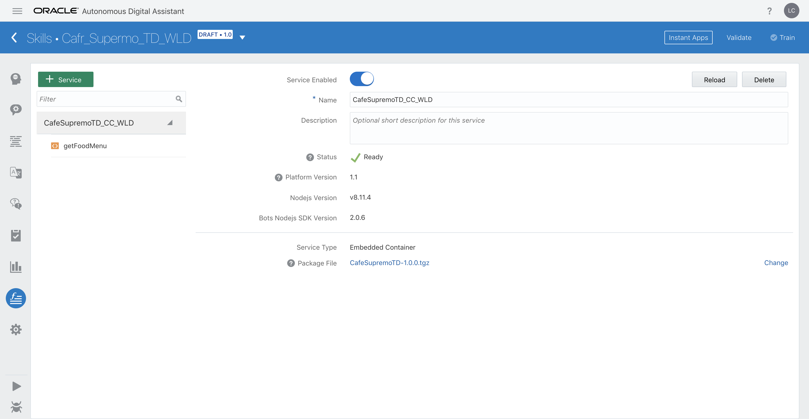
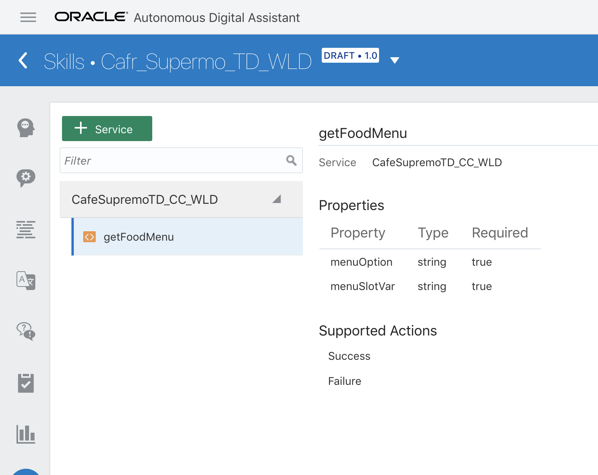

# ORACLE Cloud Test Drive #

## Lab 3: 自定义组件 ##

### 介绍 ###

要使Chatbot为对话增加价值，它必须能够返回当前和有效数据以响应问题。也就是说，最终它需要集成到一个组织的后端数据存储（业务系统）中，该数据存储包含所需的信息; 例如银行信息，HR应用程序中的员工信息或Sales CRM系统中的销售信息等。

Oracle Intelligent Bot Platform通过使用自定义会话状态（称为自定义组件）与后端数据集成，允许对数据和/或对该数据的处理（例如“getAccountBalance”）进行简单的声明性引用。

此外，使用“自定义组件”允许Bot Dialogue(对话流程)开发人员与负责从后端应用程序检索数据的人员之间的“技能分离”。也就是说，业务人员可以专注于会话流的本质（本质上是声明性的），而专业开发人员可以专注开发后端的数据接口。

注意：自定义组件作为基于REST的微服务暴露给Dialog流，虽然它们可以用任何语言开发，但使用NODE.js和相关的JavaScript SDK是迄今为止最简单的方法。
  
在本实验课程中，您将了解如果通过Bot平台与企业业务系统进行集成：
 - 从后端业务系统中动态获取数据；
 - 包含额外的UI功能以改善用户体验；
 
#### 静态菜单通过自定义组件转换为动态可视化页面 ####

<table width="75%" border="0">
  <tr>
    <td align="Center"></td>
    <td width="20%">Converted to =></td>
    <td align="Center"></td>
  </tr>
</table>

### 在ODA中创建自定义组件 ###

#### 本实验先决条件 ####
在本练习中，您首先需要下载[自定义组件模板](Lab_Files/CafeSupremoTD_Embed.zip)，下载完成后进行备用。

### 当您下载完自定义组件模板之后，进行自定义组件的创建共分为如下几步 ##

1、请返回Digital Assistant Builder（如果已关闭，请重新打开Bot）

2、单击组件服务图标已访问自定义组件服务页面



单击 **``[+ Service ]``** 按钮为您的Bot定义新的自定义组件服务。



3、打开电脑本机终端命令行，将之前所下载文件夹打包成tgz格式压缩包。
#### 前提条件：电脑上可以运行npm命令，如果无法运行请安装npm ####

首先需要进入包含有 ** ``packag.json`` ** 和 ** ``main.js`` ** 文件的目录下，运行命令
`npm pack`



4、返回Digital Assistant Builder 创建服务页面：

首先填写服务名称：服务名称 ： **``CafeSupremoTD_CC_[YOUR INITIALS]``**
选择 **``Embedded Container``** 单选框
上传刚所压缩的tgz文件



5、单击 **``[Create]``** 按钮来进行服务组件的注册。



6、注册组件服务后，将显示可在对话流中使用的组件。
- 单击 ``CafeSupremoTD_CC_xxx`` 服务条目以显示单个组件 **getFoodMenu**
- 单击 ``getFoodMenu`` 条目以查看组件中所需的属性和支持的操作。



7、选择Dialog图标返回Dialog选项卡。


向下滚动以查找以下YAML片段

```yaml
# #########################################################################################
# TEST DRIVE LAB 3: Custom Component
#
# Dynamically show the Appropriate Menu, based on the selected food requirement.  
# This one component replaces the original (multiple) hard coded menu states below. 
# #########################################################################################
 
#  showMenu:
#    component: "getFoodMenu"
#    properties: 
#      menuSlotVar: "menuItem"
#      menuOption:  ${menu.value}
#    transitions:
#      actions:
#        Success: "getFoodHeatedOption"

#        Success: "wasSandwichChosen"
# (Replace success Action in Lab 4 => "wasSandwichChosen")
# #########################################################################################

```

这引用了您刚刚注册的自定义组件，并动态地从在线菜单系统返回数据，同时还不再需要各种附加菜单（以及为菜单引入不同的UI）

6. 删除 **``"#"``** 标识符，从 **``showMenu``** 到 **``Success``** 所包含的内容

<table width="75%" border="0">
  <tr>
    <td>
    <pre>
#  showMenu:
#    component: "getFoodMenu"
#    properties: 
#      menuSlotVar: "menuItem"
#      menuOption:  ${menu.value}
#    transitions:
#      actions:
#        Success: "getFoodHeatedOption"
    </pre>
    </td>
    <td width="20%"><strong>Converted to =></strong></td>
    <td>
    <pre>
showMenu:
  component: "getFoodMenu"
  properties: 
    menuSlotVar: "menuItem"
    menuOption:  ${menu.value}
  transitions:
    actions:
      Success: "getFoodHeatedOption"
    </pre>
    </td>
  </tr>
</table>

7. 在“Bot Tester”中再次运行Bot以查看自定义组件的影响。在这种情况下，组件正在生成基于Oracle Bot公共消息模型的UI，该模型允许开发跨多个渠道运行的复杂用户交互（但具有渠道的外观和感觉）。


进入 [Lab 4](400-IB.md), 您将学习如何配置Bot以使用 "**Instant App**" 来构建向导来设计三明治。


## 动手实验结束 ##

# 实验练习: #
<< [返回 Digital Assistant Test Drive 主页](../README-ODA.md)
