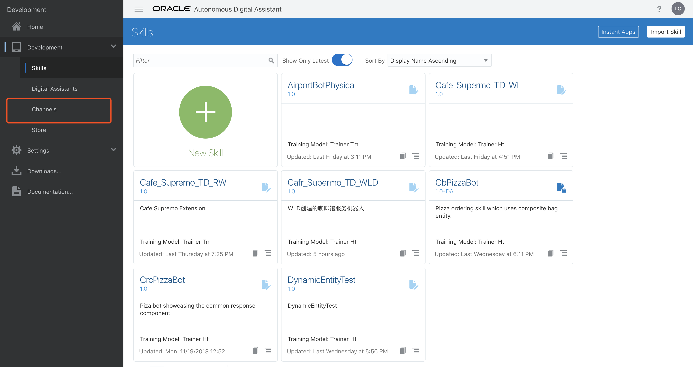
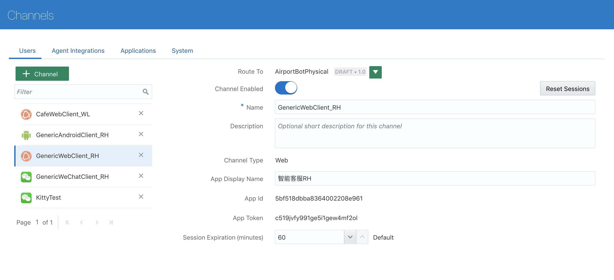
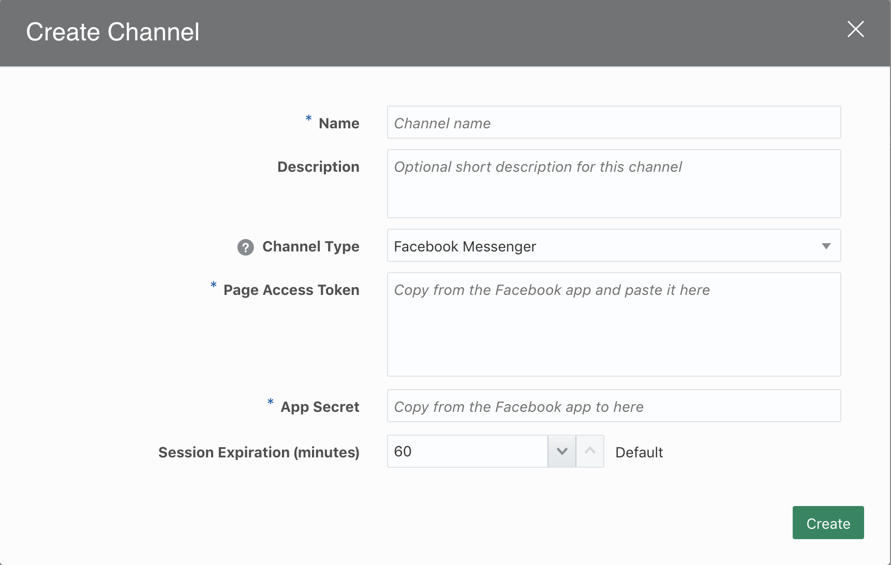
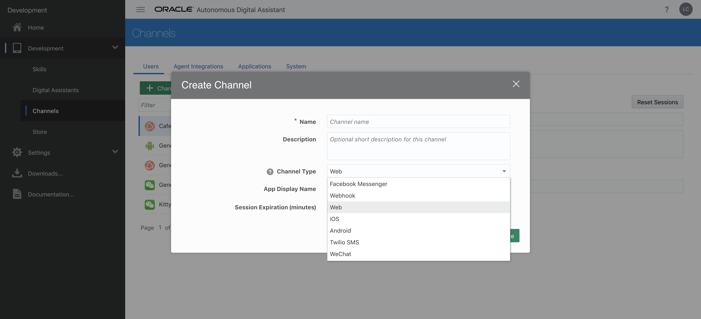
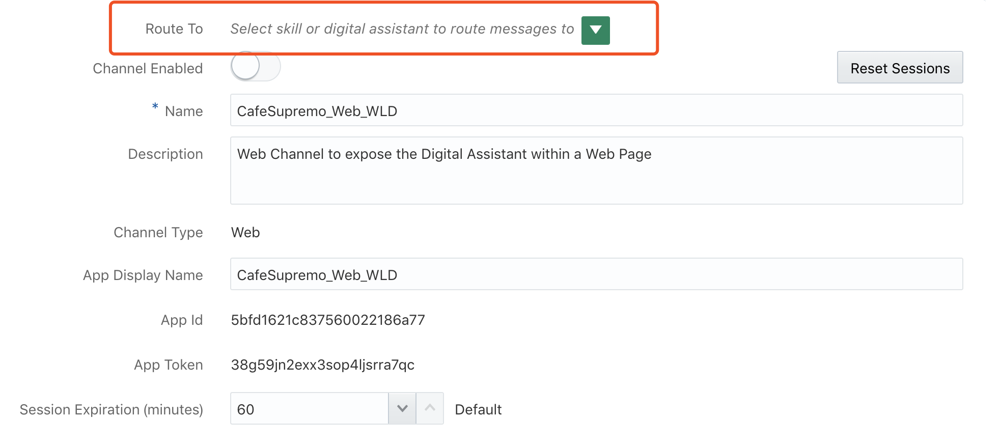
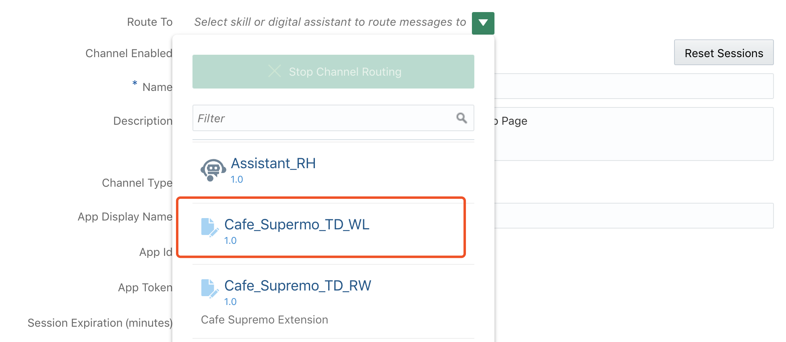

# ORACLE Cloud Test Drive #

## Lab 5： 发布数字助理网页版 ##

### 介绍 ###
构建数字助理后，下一步是确定哪个“渠道”最适合使用，以便最大限度地提高用户的访问流量。对于B2C环境，这可能需要使用一个流行的社交网络（如Facebook Messenger或微信），而对于以员工为中心的环境，与企业内部网门户的集成可能是允许轻松访问会话界面的最佳选择。

在本实验中，您将看到通过使用JavaScript Client SDK将聊天客户端集成到Web应用程序是多么容易，如下所示。


### 先决条件 ###
为了托管网页，您将在桌面上部署一个简单的基于Node.js的Web服务器。这将需要为您的操作系统安装Node运行时。虽然本实验应该可以在旧版本的Node上成功运行，但建议您升级到适用于您平台的最新稳定版（LTS）。

- 转到 [https://node.js.org](https://node.js.org) 并为您的计算机下载/安装当前的LTS版本

  - **注意** 操作系统的下载应该是默认选项。

例如：


- 通过在命令“提示符/终端”窗口中执行以下命令，安装Node.js运行时并确认它已成功运行。

`node --version`


# 实验练习 #

## 1. 为您的数字助理创建一个Web渠道

1. 在Digital Assistant Builder中返回主页面，单击左上角“汉堡包”按钮，选择 ** `Channels` **





2. 单击 `[+ Channel]` 按钮



在“Create Channel”对话框中，为通道指定名称和描述

<table width="50%" border="0">
  <tr>
    <td>Name:</td>
    <td>CafeSupremo_Web_[YOUR INITIALS]</td>
  </tr>
    <tr>
    <td>Description:</td>
    <td>Web Channel to expose the Digital Assistant within a Web Page</td>
  </tr>
  <tr>
    <td>Channel Type:</td>
    <td>Web</td>
  </tr>
</table>



点击 `[Create]`

3. 配置 **Route To** 来选择你配置的渠道是针对哪一个Bot。请选择你自己的Bot名字。





4. 将 **Channel Enabled** 开关打开。


## 2. 配置Web应用程序

1. 如果您还没有这样做，请将 [Web App](Lab_Files/CTD3.0-CafeSupremo-Web.zip) 下载到桌面。

2. 展开Zip文件(CTD3.0-CafeSupremo-Web).

3. 打开命令提示符/终端窗口并导航到该 `CTD3.0-CafeSupremo-Web/app` 文件目录中.

4. 在文本编辑器（或HTML编辑器中，如果有可用的文件）中打开 **index.html** 文件，并滚动到文档的末尾以查找指示的部分。

```html
<!-- 
  =========================================================================== 
  =          Update the AppID entry in the loadBot() function               =
  =========================================================================== 
-->
  <script type="text/javascript" src="odaScript/chatWidget.js"></script>
      
  <script> 
        loadBot('REPLACE WITH THE DIGITAL ASSISTANT APPID');
  </script>
      
  <!-- ================================================================== -->
```
 - 将 **loadBot()** 函数的参数替换为您在上一节中复制的 **AppID** 。
 
 - 保存 **index.html** 文件.
 
 5. 将目录更改回Web应用程序的根文件夹（CTD3.0-CafeSupremo-Web）。确认此文件夹包含package.json文件。
 
 6. 确保您位于指定的目录中，运行以下命令：
 
 **`npm install`**
 
- 这会将Web服务器应用程序和任何依赖项部署到计算机上安装的本地Node.js容器


7. 要运行服务器，请执行以下命令

**`node server.js`**

如果服务器正确启动，您应该看到一条消息，报告服务器正在侦听 **port 3000**


**注意:**  如果当前在端口3000上运行了另一个进程，则可以通过编辑 **server.js** 文件中的条目来更改Web服务器的侦听端口，如下所示;

```javascript
app.listen(3000, function() {
  console.log('listening on port 3000');
});
```
## 3. 访问您的数字助理

1. 打开浏览器并导航到URL **[http://localhost:3000](http://localhost:3000)


2. 单击数字助理按钮以在页面中启动聊天客户端。


3. 输入您在第二个实验室中使用的一个语句

eg. **`Can I have a beef pie`**


## 4. 自定义聊天客户端的“外观”
通过在Javascript Client SDK中定义适当的设置，可以轻松修改聊天客户端的颜色和显示文本，如下所示;

1. 在命令提示符/终端中导航到该 `CTD3.0-CafeSupremo-Web/app/odsScript` 文件夹；

2. 在文本编辑器中打开 **chatWidget.js** 文件，然后向下滚动到 **loadBot()** 函数。

查看Web Channel SDK 的 **Bots.init()** 函数中的各种设置。

```javascript
Bots.init({
        appId: appId,
        businessIconUrl:   '/images/oracle-o-logo.png',
        businessName:      'Cafe Supremo CoffeeBot',
        businessIconUrl:   './css/images/CafeSupremo-Logo.png',
        buttonIconUrl:     './css/images/CafeSupremo-Bot-Button2.png',
        backgroundImageUrl:'./css/images/CafeBackground10.png', 
        buttonWidth:       '80px',
        buttonHeight:      '80px',
        customColors:      {
                            brandColor:       'ffcccc', 
                            conversationColor:'519FF7', 
                            actionColor:      '0057B8'
                           },
        customText:        {
                            headerText:       'The Best in Tea & Coffee',
                            inputPlaceholder: 'Send me a message...',
                            introductionText: 'Your Virtual Barista'        
                            // locale:                           'en-US',
                            // soundNotificationEnabled:          true,
                            // imageUploadEnabled:                true,
                            // displayStyle:                      'button',
                            // actionPostbackError:               'An error occurred while processing your action. Please try again.',
                            // clickToRetry:                      'Message not delivered. Click to retry.',
                            // conversationTimestampHeaderFormat: 'MMMM D YYYY, h:mm A',
                            // fetchHistory:                      'Load more',
                            // fetchingHistory:                   'Retrieving history...',
                            // invalidFileError:                  'Only images are supported. Choose a file with a supported extension (jpg, jpeg, png, gif, or bmp).',
                            // locationNotSupported:              'Your browser does not support location services or it’s been disabled. Please type your location instead.',
                            // locationSecurityRestriction:       'This website cannot access your location. Please type your location instead.',
                            // locationSendingFailed:             'Could not send location',
                            // locationServicesDenied:            'This website cannot access your location. Allow access in your settings or type your location instead.',
                            // messageError:                      'An error occurred while sending your message. Please try again.',
                            // messageIndicatorTitlePlural:       '({count}) New messages',
                            // messageIndicatorTitleSingular:     '({count}) New message',
                            // messageRelativeTimeDay:            '{value}d ago',
                            // messageRelativeTimeHour:           '{value}h ago',
                            // messageRelativeTimeJustNow:        'just now',
                            // messageRelativeTimeMinute:         '{value}m ago',
                            // messageTimestampFormat:            'hh:mm A',
                            // messageSending:                    'Sending...',
                            // messageDelivered:                  'Delivered',
                            // sendButtonText:                    'Send',
                            // settingsHeaderText:                'Settings',
                            // tapToRetry:                        'Message not delivered. Tap to retry.',
                            // unsupportedMessageType:            'Unsupported message type.',
                            // unsupportedActionType:             'Unsupported action type.'
                           }
```
3. 将以下属性设置为自定义聊天客户端。

<table width="50%" border="0">
  <tr>
    <td>backgroundImageUrl:</td>
    <td>./css/images/CafeBackgroundNEW.png</td>
  </tr>
  <tr>
    <td>conversationColor:</td>
    <td>00cc33</td>
  </tr>
  <tr>
    <td>headerText:</td>
    <td>Cloud Test Drive</td>
  </tr>
  <tr>
    <td>introductionText:</td>
    <td>The New Digital Assistant</td>
  </tr>
</table>

4. **Save and Exit** 文件并导航回应用程序的根文件夹 `CTD3.0-CafeSupremo-Web`.

5. 通过 **`Control-C`** 在启动应用程序的窗口中发出一个来终止正在运行的Web应用程序。


6. 重新运行 `npm install` 和 `node server.js` 命令以将新版本的Web应用程序加载到节点容器中并启动Web服务器。 

7.  **`http://localhost:3000`** 在浏览器中重新打开URL


**注意:** 您可以通过单击 **`[Clear the Chat]`** 页脚上方的按钮来清除聊天会话的内容。

## 结论 ##
 
在本实验中，您了解了如何通过使用Digital Assistant Web-Channel和Javascript Chat Client Client SDK，可以快速轻松地将数字助理添加到您的网站。


## 实验结束 ##


# 实验练习: #
<< [返回 Digital Assistant Test Drive 主页](../README-ODA.md)
